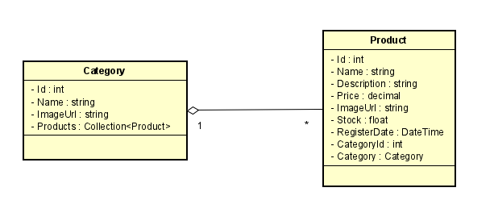

# CatalogAPI - API for Products and Products Categories management

### API developed during the Course "Web API ASP .NET Core Essential" from Udemy, lectured by Macoratti. I'm diving into the world of C# and ASP .Net in order to develop an Extension Project that I subscribed and was selected to be part of.

---

## Techs

* C# 11
* ASPNet 7
* .Net 7
* Swagger OpenAPI 3
* Dockerfile
* Docker compose

## Trying it out

Clone the repo:

```
git clone git@github.com:GPMrks/CatalogAPI.git
```

Inside the project's folder run the following command:

```
docker compose up --build
```

Access:
```
https://localhost:8000
```

## Entities

## Model Diagram



### Category

* Id
* Name
* ImageUrl
* Products

### Product

* Id
* Name
* Description
* Price
* ImageUrl
* Stock
* RegisterDate
* CategoryId
* Category

## Stay in touch

- Author - [Guilherme Marques](https://www.linkedin.com/in/guilherme-p-marques/)
- Website - [https://github.com/GPMrks](https://github.com/GPMrks)


